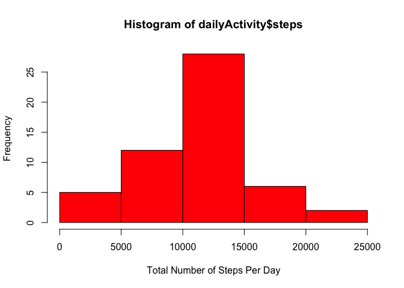
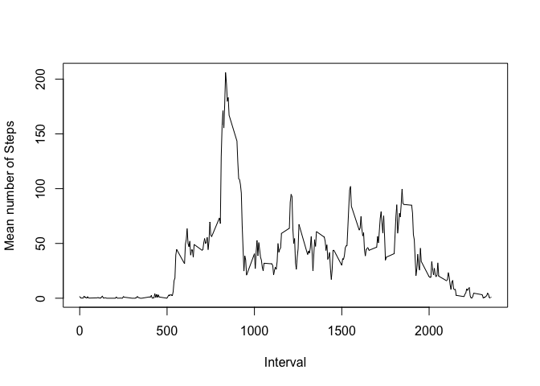
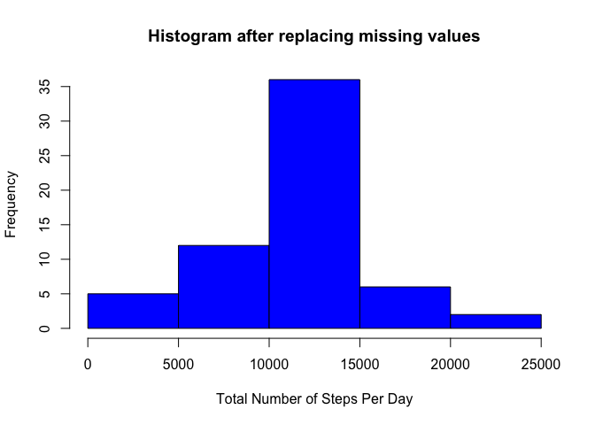
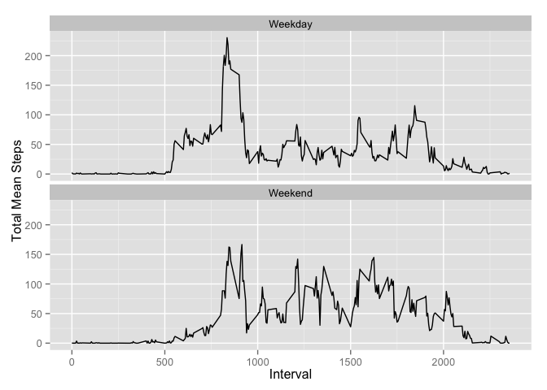

# PA1_template

## Setting Global config

```r
library(knitr)
opts_chunk$set(echo = TRUE)
```

## Loading and preprocessing the data

* Assumption: activity.csv in current working directory under 'data'
* Dataset used for current assignment - [Activity](https://d396qusza40orc.cloudfront.net/repdata%2Fdata%2Factivity.zip)

Reading the data as follows


```r
activity <- read.csv("./data/activity.csv", stringsAsFactors=FALSE)
```

Exploring the data


```r
head(activity)
```

```
##   steps       date interval
## 1    NA 2012-10-01        0
## 2    NA 2012-10-01        5
## 3    NA 2012-10-01       10
## 4    NA 2012-10-01       15
## 5    NA 2012-10-01       20
## 6    NA 2012-10-01       25
```

```r
tail(activity)
```

```
##       steps       date interval
## 17563    NA 2012-11-30     2330
## 17564    NA 2012-11-30     2335
## 17565    NA 2012-11-30     2340
## 17566    NA 2012-11-30     2345
## 17567    NA 2012-11-30     2350
## 17568    NA 2012-11-30     2355
```

Formatting Dates correctly

```r
activity$date = as.Date(activity$date, format= "%Y-%m-%d")
str(activity)
```

```
## 'data.frame':	17568 obs. of  3 variables:
##  $ steps   : int  NA NA NA NA NA NA NA NA NA NA ...
##  $ date    : Date, format: "2012-10-01" "2012-10-01" ...
##  $ interval: int  0 5 10 15 20 25 30 35 40 45 ...
```

## What is mean total number of steps taken per day?

* Aggregating data by day
* Making histogram of total number of steps per day


```r
dailyActivity <- aggregate(steps~date, data=activity, FUN=sum)
head(dailyActivity)
```

```
##         date steps
## 1 2012-10-02   126
## 2 2012-10-03 11352
## 3 2012-10-04 12116
## 4 2012-10-05 13294
## 5 2012-10-06 15420
## 6 2012-10-07 11015
```

```r
hist(dailyActivity$steps, col="red", xlab = "Total Number of Steps Per Day", ylab = "Frequency")
```

 

* Mean and Median of total number of steps taken in day


```r
meanDailySteps <- mean(dailyActivity$steps)
medianDailySteps <- median(dailyActivity$steps)
```

##### Mean daily Steps : 1.0766189\times 10^{4} 
##### Median Daily Steps : 10765

(Note: 10^4 in mean. for some reason Knit is converting into 10^4 format)

## What is the average daily activity pattern?

* Aggregating data by interval and take a mean


```r
intervalActivity <- aggregate(steps~interval, data=activity, FUN=mean)
head(intervalActivity)
```

```
##   interval     steps
## 1        0 1.7169811
## 2        5 0.3396226
## 3       10 0.1320755
## 4       15 0.1509434
## 5       20 0.0754717
## 6       25 2.0943396
```

* Plot intervalActivity

```r
plot(x=intervalActivity$interval, y=intervalActivity$steps, type='l', xlab = "Interval", ylab = "Mean number of Steps")
```

 

```r
maxRowObservation <- intervalActivity[which.max(intervalActivity$steps),]
```
##### Maximum mean total steps are 206.1698113 observed during 835th interval

## Imputing missing values

* Calculating missing values (NA)

```r
totalMissingValues <- sum(is.na(activity$steps))
```
**Total Missing Values 2304**

Plan is replace the missing (NA) values with the mean corresponds the same interval. I am writing a new function which would clean and replace missing values with daily mean for corresponding interval.


```r
replaceNaWithMean <- function(x, meanActivity){       
        cleanActivity <- data.frame(steps = x$steps, date=x$date, interval = x$interval)
        
        for( i in (1:nrow(cleanActivity))){
                if(is.na(cleanActivity[i,]$steps)){
                        cleanActivity[i,]$steps = meanActivity[meanActivity$interval == cleanActivity[i,]$interval,]$steps
                }
        }
        cleanActivity
}
```

Using replaceNaWithMean function, cleaning the activity dataset


```r
cleanedActivity <- replaceNaWithMean(activity, intervalActivity)
```

* Aggregating data by day for cleaned activity
* Making histogram of total number of steps per day


```r
cleanedDailyActivity <- aggregate(steps~date, data=cleanedActivity, FUN=sum)
head(cleanedDailyActivity)
```

```
##         date    steps
## 1 2012-10-01 10766.19
## 2 2012-10-02   126.00
## 3 2012-10-03 11352.00
## 4 2012-10-04 12116.00
## 5 2012-10-05 13294.00
## 6 2012-10-06 15420.00
```

```r
hist(cleanedDailyActivity$steps, col="blue", xlab = "Total Number of Steps Per Day", ylab = "Frequency", main = "Histogram after replacing missing values")
```

 

* Mean and Median of total number of steps taken in day


```r
cleanedMeanDailySteps <- mean(cleanedDailyActivity$steps)
cleanedMedianDailySteps <- median(cleanedDailyActivity$steps)
```

##### Mean daily Steps after replacing missing values: 1.0766189\times 10^{4} 
##### Median Daily Steps after replacing missing values: 1.0766189\times 10^{4} 

(Note: 10^4 in mean. for some reason Knit is converting into 10^4 format) 

So, conclusion is as I used interval average instead of daily average, overall there is no much of the difference after replacing missing values other than little shift in median.


## Are there differences in activity patterns between weekdays and weekends?

First adding a new column 'day' to cleanedActivity depending upon the date
and then will add dayType as another column as weekend if day is 'Saturday' or 'Sunday' otherwise mark it as weekday


```r
cleanedActivity$day <- weekdays(cleanedActivity$date)
cleanedActivity$dayType <- ifelse(cleanedActivity$day != "Sunday" & cleanedActivity$day != "Saturday","Weekday", ifelse(cleanedActivity$day == "Sunday" | cleanedActivity$day == "Saturday", "Weekend", NA))
```

Just making sure if transformation of columns is correct


```r
head(cleanedActivity[cleanedActivity$dayType == 'Weekday',])
```

```
##       steps       date interval    day dayType
## 1 1.7169811 2012-10-01        0 Monday Weekday
## 2 0.3396226 2012-10-01        5 Monday Weekday
## 3 0.1320755 2012-10-01       10 Monday Weekday
## 4 0.1509434 2012-10-01       15 Monday Weekday
## 5 0.0754717 2012-10-01       20 Monday Weekday
## 6 2.0943396 2012-10-01       25 Monday Weekday
```

```r
head(cleanedActivity[cleanedActivity$dayType == 'Weekend',])
```

```
##      steps       date interval      day dayType
## 1441     0 2012-10-06        0 Saturday Weekend
## 1442     0 2012-10-06        5 Saturday Weekend
## 1443     0 2012-10-06       10 Saturday Weekend
## 1444     0 2012-10-06       15 Saturday Weekend
## 1445     0 2012-10-06       20 Saturday Weekend
## 1446     0 2012-10-06       25 Saturday Weekend
```

Plotting and comparing 5 min interval graph for weekday vs weekend

* Aggregating data by interval and dayType for cleaned activity
* Plotting mean number of steps per interval per dayType (using ggplot2)


```r
library(ggplot2)
dayTypeIntActivity <- aggregate(steps~interval+dayType, data=cleanedActivity, FUN=mean)

ggplot(dayTypeIntActivity, aes(x=interval, y=steps)) + geom_line() + facet_wrap(~dayType, nrow = 2, ncol = 1) + labs(x="Interval", y="Total Mean Steps") 
```

 

##### From the comparison of the graph, I would conclude, during the weekdays there is spike in average number of steps and similar spike over a weekend during specific interval in the morning. Which may suggest some sort of regular activity in the morning. Overall, average steps (activity) over weekend are more than those of during weekday.

 
